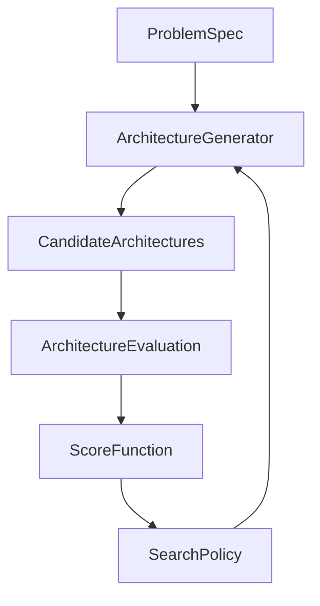

# Assess SASE Direction

## Current Baseline

- Confirm the existing refinement loop in `[/Users/jasongelinas/workspace/prscope/src/prscope/planning/runtime/pipeline/adversarial_loop.py](/Users/jasongelinas/workspace/prscope/src/prscope/planning/runtime/pipeline/adversarial_loop.py)` and `[/Users/jasongelinas/workspace/prscope/src/prscope/planning/runtime/pipeline/stages.py](/Users/jasongelinas/workspace/prscope/src/prscope/planning/runtime/pipeline/stages.py)`: `design_review -> repair_plan -> revise_plan -> validation_review -> convergence_check`.
- Ground the review in the persisted graph model from `[/Users/jasongelinas/workspace/prscope/docs/decision-and-issue-graphs.md](/Users/jasongelinas/workspace/prscope/docs/decision-and-issue-graphs.md)`, especially how `decision_graph`, `issue_graph`, and `impact_view` already encode plan pressure and unresolved risk.
- Frame the current runtime as a bounded improvement cycle over a persisted design state, not as one-shot generation.

## SASE Framing

- Define the target idea clearly: a software architecture search engine treats software design as a search problem over candidate architectures, not just a one-shot planning problem.
- Make the target loop explicit:



- Use the user’s architecture dimensions as the notional search space:
  - system decomposition
  - module boundaries
  - data architecture
  - communication patterns
  - infrastructure model
- Treat this framing as a long-term north star, not the immediate project scope.

## Review Criteria

- Separate three claims:
  - `prscope` already has a closed refinement loop.
  - `prscope` already has heuristic scoring and convergence gates.
  - `prscope` does not yet have a true search objective or multi-candidate optimization loop.
- Use `[/Users/jasongelinas/workspace/prscope/src/prscope/planning/runtime/reasoning/convergence_reasoner.py](/Users/jasongelinas/workspace/prscope/src/prscope/planning/runtime/reasoning/convergence_reasoner.py)` and `[/Users/jasongelinas/workspace/prscope/src/prscope/planning/runtime/critic.py](/Users/jasongelinas/workspace/prscope/src/prscope/planning/runtime/critic.py)` to distinguish heuristic quality control from a hard optimization metric.
- Evaluate whether the existing graph artifacts can support a first-generation score over:
  - unresolved decisions
  - open issue severity
  - dependency blockage
  - decision pressure
  - evidence gaps
- Distinguish clearly between:
  - heuristic quality control
  - deterministic architecture scoring
  - true multi-candidate architecture search

## Candidate Score Sketch

- Include a deliberately simple first-pass score sketch to anchor the review.
- Prefer a tiered pressure model over a flat weighted sum so true architecture blockers dominate lower-signal gaps:

```text
score =
  100 * unresolved_required_decisions
  + 20 * high_severity_open_issues
  + 5 * unresolved_dependency_chains
  + 2 * impact_pressure
  + 1 * evidence_gaps
```

- Treat lower score as stronger architecture state.
- Emphasize that this is a first observational metric, not yet a complete objective over cost, latency, complexity, and business value.
- Explicitly validate whether `impact_pressure` should mean raw impact size or only unresolved architectural pressure; clearer plans may expose more impact structure without actually getting worse.

## Focused Recommendation

- Recommend a narrow path:
  - keep `prscope` as a single-plan hill-climbing refiner
  - add an explicit deterministic architecture score from existing graph state
  - validate the score as an observational metric before using it to control the loop
- Keep the initial score intentionally simple:
  - unresolved required decisions
  - open issue severity
  - unresolved dependency chains
  - decision pressure from `impact_view`
  - missing evidence
- Use the score first to answer one narrow question:
  - did this round measurably improve the plan?
- Add round-to-round score tracking as part of the recommendation:
  - `Round 1 score -> Round 2 score -> Round 3 score`
  - use the trend for observability, stagnation detection, and critic-loop debugging before using it for control

## Deferred Capabilities

- Explicitly defer these until scoring is stable:
  - candidate architecture populations
  - mutation or crossover operators
  - beam search / branch-and-compare planning
  - benchmark-style evaluation harness for competing architectures
  - any claim of full architecture search or evolutionary optimization
- Call out that the gap to true SASE includes:
  - no first-class candidate architecture population
  - no explicit mutation or structural operators
  - no stable selection objective for comparing architectures
  - no selection or promotion policy across competing plans

## Recommendation Shape

- Frame the idea as: `prscope` is already doing architecture hill climbing, and the next step is to make that loop measurable.
- Recommend a staged path if pursued:
  - first define an explicit scorer over unresolved decisions, issue severity, dependency blockage, unresolved impact pressure, and evidence gaps
  - then validate scorer stability offline against existing sessions or benchmark artifacts
  - then use the score for visibility, optimization-curve tracking, and regression detection inside the current loop
  - only after that consider small branch search with 2-5 candidate plans
- Keep the recommendation honest: the first milestone is not “best architecture found,” but “did this round measurably improve the plan?”

## Key Decision

- Decide whether the goal is:
  - a better convergence metric for the current single-plan loop
  - or a later redesign toward branch search with competing candidate plans and selection
- Default recommendation: choose the first option now.

## Review Output

- The review should answer:
  - whether the SASE vision is strategically compelling
  - which parts of `prscope` already resemble an architecture evaluation engine
  - which claims are currently hype versus technically grounded
  - what minimum system additions would make the vision real enough to prototype
  - why a scored hill-climber is the right near-term scope boundary
- Organize the final write-up in this order:
  - current baseline
  - SASE framing
  - claim evaluation
  - graph-support-for-scoring
  - core capability gap
  - focused recommendation
  - deferred capabilities
  - strategic assessment
  - minimum additions to prototype the vision
  - key decision / final conclusion

