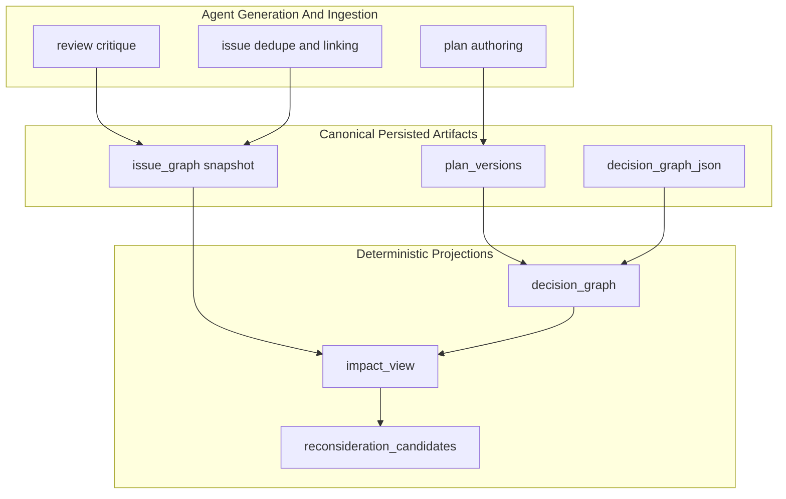

# Decision And Issue Graphs

This document explains the core graph-shaped planning artifacts in prscope:

- `decision_graph`: stable architectural decision state for a specific plan version
- `issue_graph`: graph-backed review and validation state for a live planning session
- `impact_view`: derived cross-graph reasoning output computed from the first two

Prscope treats architecture planning as a deterministic graph system. Persisted artifacts store the canonical planning state, while runtime graphs and views are recomputable projections over that state.

They are related, but they serve different purposes and live in different places.

## Why Two Graphs

The system tracks two different kinds of state:

- architectural choices and unresolved design questions
- review findings, causal chains, dependencies, and resolution state

Keeping them separate preserves a clean boundary:

- the decision graph records what the plan says or still needs to decide
- the issue graph records what critics and validation discovered about the plan
- review state may point at relevant decisions, but architectural state does not depend on review state

This separation is intentional. A plan version can have durable architectural state even when no review graph exists, and a review graph can evolve across rounds without redefining the underlying decision model.

`impact_view` sits on top of that boundary. It is not a third source of truth. It is a derived reasoning surface that makes architectural pressure visible without mutating either persisted graph.

## Mental Model

The graph architecture is easiest to reason about in three layers:

Prscope treats architecture planning as a layered system:

1. Canonical persisted artifacts store the authoritative planning state.
2. Deterministic projections (read models) compute runtime views over that state.
3. Agent-driven authoring and review update persisted artifacts through controlled ingestion.

All projection layers above persistence must remain deterministic and recomputable from explicit inputs.

This layering keeps the core invariant simple:

- persisted artifacts are canonical state
- runtime graphs and views are deterministic read models over explicit persisted inputs
- authoring, critique, and ingestion may use model-driven logic, but their outputs only become authoritative after persistence

Terminology note:

- `decision_graph_json` is the canonical persisted artifact stored on a plan version
- `decision_graph` is the runtime graph object or API field derived from persisted artifacts
- the session `issue_graph` snapshot is the canonical persisted review artifact
- the runtime `issue_graph` structure loaded from that snapshot is a deterministic projection over the persisted payload

## Projection Rules

All graph-derived read models should:

- depend only on explicit persisted inputs
- avoid model calls, timestamps, and randomness
- produce identical output for identical inputs
- remain safe to recompute after reload, retry, or crash recovery

## Non-Hermetic Boundary

Issue ingestion may use model-assisted similarity and linking, for example embedding-backed dedupe, before the final `issue_graph` snapshot is persisted.

Once persisted, the snapshot becomes canonical input and all runtime projections remain deterministic.

## Decision Graph

### Purpose

The canonical persisted planning-state artifact for a plan version is `decision_graph_json`.

The runtime `decision_graph` projection captures:

- architecture decisions already made in the plan
- unresolved questions that still need answers
- dependencies between decisions when they are declared explicitly

That deterministic projection is also the source for persisted follow-up questions shown after a plan is generated.

### Ownership

Primary code paths:

- `src/prscope/planning/runtime/followups/decision_graph.py`
- `src/prscope/planning/decision_catalog.py`

The backend treats persisted decision graph state as primary. Markdown extraction exists as compatibility/backfill behavior, not as the preferred source of truth.

### Shape

A decision graph contains:

- `nodes`: map keyed by decision id
- `edges`: list of decision relationships, currently `depends_on`

Each decision node carries:

- `id`: stable identifier, often catalog-backed like `architecture.database`
- `description`: the user-facing decision question
- `options`: allowed answers when known
- `value`: selected answer, or `null` when unresolved
- `section`: target plan section such as `architecture`
- `required`: whether the decision should be answered
- `concept`: normalized semantic identity used for matching across versions
- `evidence`: short strings describing where the node came from

### How It Is Built

Decision graph construction merges three explicit inputs:

1. Open questions extracted from planning state.
2. Catalog-backed matches found in plan sections like `Architecture` and `Design Decision Records`.
3. Explicit decision blocks in markdown, including optional dependencies.

When a new plan version is created, the runtime `decision_graph` projection is merged with the previous plan version's graph so answers can carry forward even if wording changes slightly. Matching prefers:

- exact id
- semantic identity via `(section, concept)`
- fuzzy description similarity

This makes the graph resilient to normal plan editing and rewording.

### Persistence And API Exposure

Decision graph state is stored on `plan_versions` as:

- `decision_graph_json`
- `followups_json`

The API parses those JSON columns into structured response fields:

- `decision_graph`
- `followups`

So the persisted JSON remains authoritative, while the API field `decision_graph` is the materialized runtime structure exposed to clients.

The frontend consumes `current_plan.decision_graph` directly rather than rebuilding decision state from markdown.

### Follow-Ups

Unresolved required decision nodes become follow-up question artifacts. Each follow-up points back to:

- the decision id
- the target plan section
- the concept / semantic identity

Answering a follow-up updates the persisted decision graph state first; the rendered plan can then be refreshed from that updated state.

## Issue Graph

### Purpose

The canonical persisted review artifact is the session `issue_graph` snapshot.

The runtime `issue_graph` structure tracks:

- open and resolved issues
- causal chains between issues
- dependency relationships that block resolution
- duplicate detection and canonical issue ids
- links from issues to related architectural decisions

That structure replaces a purely flat issue list with something that can explain why an issue exists and what else it affects.

### Ownership

Primary code paths:

- `src/prscope/planning/runtime/review/issue_graph.py`
- `src/prscope/planning/runtime/review/issue_causality.py`
- `src/prscope/planning/runtime/reasoning/review_reasoner.py`

The tracker owns canonical ids, graph mutation, propagation semantics, snapshot serialization, and snapshot reload.

### Shape

An issue graph snapshot contains:

- `nodes`: list of issue nodes
- `edges`: list of graph edges
- `duplicate_alias`: alias id to canonical issue id map
- `summary`: derived counts used by the UI

Each issue node includes:

- `id`
- `description`
- `status`: `open` or `resolved`
- `raised_round`
- `resolved_round`
- `resolution_source`
- `severity`: `major`, `minor`, or `info`
- `source`: `critic`, `validation`, or `inference`
- `issue_type`: currently `architecture`, `ambiguity`, `correctness`, or `performance`
- `tags`
- `related_decision_ids`

Supported edge relations are:

- `causes`: one issue causes or explains another
- `depends_on`: one issue cannot be resolved until another is resolved
- `duplicate`: accepted in snapshots, though duplicate handling is primarily modeled through `duplicate_alias`

### Runtime Behavior

The issue graph is updated during review rounds as issues are raised, linked, deduplicated, and resolved.

Important semantics:

- duplicate issues resolve to a canonical issue id
- resolving an issue can propagate through `causes` edges when all parent causes are resolved
- unresolved `depends_on` edges block resolution
- graph caps prune lower-value inferred or validation nodes before dropping high-signal state

The tracker also emits derived summary data such as:

- total open issues
- root open issues
- resolved total
- open counts by severity
- unresolved dependency chain count

### Persistence And API Exposure

Issue graph state is persisted in the session snapshot payload, alongside the legacy flat `open_issues` view.

Snapshot behavior:

- `open_issues` remains for backward compatibility
- `issue_graph` is the richer additive structure
- adjacency indexes are runtime-derived and are not persisted

Once persisted, the issue-graph payload is deterministic and replayable on reload.

Session APIs expose `issue_graph` directly from the snapshot, and frontend screens render from it when present.

## Impact View

### Purpose

`impact_view` is the architectural pressure model derived from `decision_graph` and `issue_graph`. It explains how review findings propagate into architectural decision risk without mutating decision state.

`impact_view` is the derived reasoning layer that answers:

- which decisions are under pressure from review state?
- what root problem is driving that pressure?
- what parts of the plan are affected?
- what action is most likely needed next?

It exists to make cross-graph reasoning explicit without contaminating plan-version decision state.

### Ownership

Primary code paths:

- `src/prscope/planning/runtime/review/impact_view.py`
- `src/prscope/planning/runtime/review/issue_types.py`
- `src/prscope/web/api.py`

The projector is intentionally separate from `decision_graph.py`. It depends on both graph payloads, typically loaded from persisted state or a current session snapshot, so it belongs with review/runtime projection logic rather than with canonical decision-state ownership.

### Shape

`impact_view` currently contains:

- `decisions`: per-decision pressure summaries
- `reconsideration_candidates`: derived candidates for explicit reconsideration prompts

Each impacted decision includes:

- `decision_id`
- `linked_issue_ids`
- `decision_pressure`
- `pressure_breakdown`
- `risk_level`
- `highest_severity`
- `dominant_cluster`
- `issue_clusters`

Each issue cluster includes:

- `root_issue_id`
- `root_issue`
- `severity`
- `issue_ids`
- `symptom_issue_count`
- `affected_plan_sections`
- `suggested_action`

### Derivation Rules

The projector is deterministic and defensive:

- it groups linked issues by causal root using `causes` edges
- it skips orphan parent references when a pruned node is no longer present
- it guards against malformed cycles with a visited set and depth cap
- it picks canonical roots deterministically by severity, `raised_round`, then issue id
- it excludes resolved issues and dependency-blocked issues from pressure scoring
- it may consult `previous_decision_graph` to compute `recently_changed` and reconsideration eligibility without introducing hidden inputs

Pressure and cluster ranking are heuristic but deterministic:

- decision pressure is driven by open linked issue severity
- cluster ranking uses a fixed severity weight table plus issue count
- action hints are rule-based, not model-generated

### Reconsideration Candidates

`impact_view.reconsideration_candidates` is part of the same deterministic projection, not a separate persisted artifact or independent pipeline stage.

It is the beginning of a controlled reconsideration loop.

It does **not** mutate `decision_graph`. Instead it surfaces when a decision is under sustained pressure and may need explicit reconsideration.

Later refinement prompts may consume these candidates directly. When no candidate clears the strict reconsideration threshold, the runtime may still pass the top medium-or-higher pressure decisions as non-persistent pressure guidance so refinement can address the most stressed architectural area without waiting for a harder failure.

Current candidate fields include:

- `decision_id`
- `reason`
- `decision_pressure`
- `dominant_cluster`
- `suggested_action`
- `recently_changed`
- `eligible`

This keeps reconsideration:

- explicit rather than automatic
- derived rather than persisted
- pressure-gated rather than thrash-prone

## How The Graphs Connect

The graphs are linked in one direction:

- issue nodes may include `related_decision_ids`
- review reasoning uses the decision graph to infer which architectural decisions an issue is about
- `impact_view` combines both graphs, and sometimes `previous_decision_graph`, into a derived read model

The reverse is intentionally not true:

- decision nodes do not import issue state
- decision graph extraction and merge do not depend on review results

This keeps architectural state deterministic and plan-version scoped, while letting review state add annotations about impact or missing decisions.

## Example Lifecycle

The end-to-end flow typically looks like this:

1. Authoring produces plan content and decision state for a new plan version.
2. `decision_graph_json` is persisted on the plan version as canonical architectural state.
3. Review rounds raise, dedupe, link, and resolve issues against the current plan.
4. The session `issue_graph` snapshot evolves across rounds and is persisted as review state.
5. `impact_view` derives architectural pressure from the current decision and issue graph payloads.
6. `reconsideration_candidates` may be surfaced during refinement when a decision remains under sustained pressure.

## Frontend Rendering

Frontend behavior today:

- `PlanPanel` augments rendered plan markdown with `decision_graph` state
- `decisionGraphRender.ts` can inject graph-backed decisions and unresolved questions not yet reflected in prose
- `ChatPanel` uses persisted follow-up artifacts derived from the decision graph
- issue views render a causal tree from `issue_graph` when present
- `PlanPanel` shows a derived architectural pressure badge and top-pressure summary from `impact_view`
- `IssuePanel` resolves `related_decision_ids` into decision chips and dominant cluster hints using `impact_view`
- if `issue_graph` is absent, the UI falls back to legacy flat `open_issues`

The frontend is server-authoritative for both graphs. It should not infer or mutate graph state locally.

## Operational Guidance

Use the decision graph when the question is:

- what architecture choice has been made?
- what architectural question is still unresolved?
- what follow-up should we ask next?

Use the issue graph when the question is:

- what problems are still open?
- which issues are root causes versus downstream effects?
- what dependencies block resolution?
- which decisions are implicated by a review finding?

Use `impact_view` when the question is:

- which decisions are under architectural pressure right now?
- what root cause is driving that pressure?
- what is the likely next action?
- should we surface an explicit reconsideration prompt?

## Invariants

Keep these invariants intact when evolving the system:

- `decision_graph_json` is the authoritative plan-version artifact
- `decision_graph` is a deterministic projection over persisted plan-version inputs
- `issue_graph` is session-scoped and may evolve across rounds
- `impact_view` is derived, ephemeral, and recomputable from current plan + session snapshot state, plus `previous_decision_graph` when reconsideration eligibility needs it
- issue state may reference decisions through ids, but decision state must not depend on review state
- persisted graphs are authoritative; derived indexes and render-time projections are not
- legacy compatibility fields may coexist with graph payloads, but graph payloads are the richer contract

